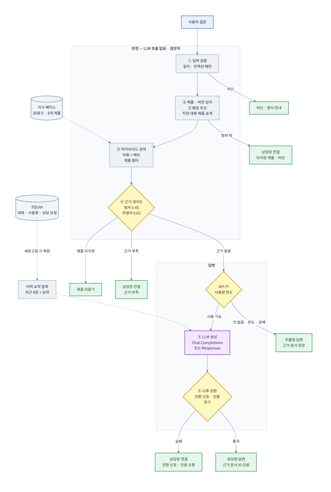

<div align="center">

# 테스트용 기술지원 AI Assistant

**Autodesk 제품 설치 기술지원 챗봇에 LLM 모델 기술 적용하여 고객 상담 기능 도입 가능 여부를<br/>검증하기 위해 만든 Streamlit 기반 프로토타입 — 설치 가이드 8종 RAG · 골든 데이터셋 평가 포함**

㈜상상진화 · Autodesk 공식 파트너 회사 기술지원 솔루션<br/>
2024.12 ~ 2025.12 · 기획/개발 1인 담당 · 2026.09 RAG 후속 구현

<br/>


</div>

---

## 해당 저장소 위치

㈜상상진화 기술지원 솔루션 프로젝트는 **두 개의 저장소**로 구성되었다.

| 단계 | 저장소 | 역할 | 상태 |
|---|---|---|---|
| 1단계 | [KakaoChatbot](https://github.com/minjaejeon0827/KakaoChatbot) | 규칙 기반 카카오 챗봇 (AWS Lambda 서버리스) | 개발 완료 · 서비스 오픈 중단 |
| 2단계 | **test_AI_Assistant** *(현재 저장소)* | 자유 형식 질문 대응 LLM 모델 상담 프로토타입 | PoC 완료 · 2026.09 RAG 후속 구현 |

1단계 카카오 챗봇은 **버튼으로 선택하는 정형 문의**를 자동화 처리한다. 다만 "설치 중 오류 발생!(코드 1603)" 같은 **비정형 질문은 구조상 처리할 수 없다.** 해당 저장소는 그 공백을 LLM 모델 사용하여 대처할 수 있는지 확인하기 위한 실험이다.

회사 프로젝트는 PoC 단계에서 중단되었다. 이후 PoC 프로토타입이 남긴 **미해결 한계 5건과 개선 계획을 2026.09 에 직접 구현하고 측정했다.** 해당 README 파일 RAG · 평가 관련 내용은 그 결과다.

> **프로젝트 배경 · 아키텍처 · 트러블슈팅 전체 내용은 [1단계 카카오 챗봇 저장소 README](https://github.com/minjaejeon0827/KakaoChatbot) 참고.**

---

## 검증 목표와 결과

### PoC (2025)

| 검증 항목 | 결과 |
|---|---|
| 비개발자도 쓸 수 있는 대화형 UI를 빠르게 만들 수 있는가 | Streamlit으로 약 50줄 수준에서 구현 가능 확인 |
| API 키를 저장소에 남기지 않고 안전하게 다룰 수 있는가 | 사이드바 입력 + 세션 메모리 보관 방식으로 해결 |
| 멀티턴 대화 맥락을 유지할 수 있는가 | `st.session_state` 기반 이력 누적으로 유지 확인 |
| **Autodesk 파트너 회사 기술지원 지식을 반영한 답변이 가능한가** | **불가 — 범용 모델 그대로는 Autodesk 제품 설치 절차를 정확히 답변하지 못함** |

마지막 항목이 PoC 프로토타입의 결론이다. **검색 단계(RAG) 없이 LLM 모델만 붙이는 방식으로는 기술지원 업무에 투입할 수 없다**는 것을 확인했다.

### RAG 후속 구현 (2026.09)

| 검증 항목 | 결과 (골든 데이터셋 test 40문항 · 어휘 검색 모드) |
|---|---|
| 넘겨야 할 질문(미지원 제품 · 버전 · 지식 베이스 밖)에 답하지 않는가 | **0건** — 전환 재현율 100% · 전환 사유 정확도 100% |
| 정상 기술지원 문의를 프롬프트 인젝션으로 오인해 막지 않는가 | **0건** — 프롬프트 인젝션 차단율 100% |
| 제품을 정확히 알아보는가 (레빗박스 ≠ 레빗, 캐드박스 ≠ 캐드) | **100%** |
| 정답 문서를 찾는가 | Hit@1 **0.808** · Recall@3 0.923 · MRR 0.859 |
| 답할 수 있는 질문에 답하는가 | **목표 미달** — 과잉 전환 34.6% (목표 ≤25%), 엉뚱한 문서로 답한 3건 |

**오안내는 막았지만, 답할 수 있는 질문의 1/3 을 상담원에게 넘긴다.** 원인은 오답 분석으로 특정했다 —
실패 13건 중 8건이 같은 원인(구어체 어미 · 공손 표현 미제거)이다. 상세는 [평가 보고서](docs/evaluation.md) 참고.

---

## 시연

<!-- TODO: assets/demo.gif 추가 후 아래 주석 해제. API 키 없이도 추출형 답변 · 상담원 연결 흐름을 녹화할 수 있다 -->
<!--
<div align="center">
  
</div>
-->

---

## 동작 구조

<div align="center">
  <picture>
    <source media="(prefers-color-scheme: dark)" srcset="assets/rag-architecture-dark.png">
    <source media="(prefers-color-scheme: light)" srcset="assets/rag-architecture.png">
    
  </picture>
</div>

<details>
<summary>mermaid 원본 보기</summary>

원본: [`docs/diagrams/rag-architecture.mmd`](docs/diagrams/rag-architecture.mmd)

</details>

**LLM 모델은 판정이 끝난 뒤에만 호출된다.** 판정(①~④)은 LLM 모델 없이 결정적으로 동작하므로 평가 · 테스트가 API 키 없이 재현된다.

---

## RAG 구현 — 핵심 판단 6가지

### 1. 원본 제품 설치 가이드 문서를 그대로 쓰지 않고 재구성했다

원본 제품 설치 가이드 문서에 URL 64개 중 **57개가 Autodesk 서명 URL(`authparam`)이고 발급 시각이 2025-06-01~02** 이다.
기간이 지나면 만료되는 링크라 RAG 기술 사용하여 AI Assistant가 해당 링크를 안내하면 오답이다.

| 원본 | 재구성 (`data/install_kb.md`) | 이유 |
|---|---|---|
| 제품당 1덩어리 (8개) | 제품 × 단계 **26청크** | "라이선스 인증은요?"에 제품 설치 절차 전체가 딸려 나오지 않게 한다 |
| 다운로드 URL 64개 | 전부 제거 · 사내 배포 링크 7개는 `{{link:키}}` | 실제 주소는 커밋하지 않는 `data/links.local.json` 에 둔다 |
| 콜센터 번호 8회 반복 | 본문에서 제거 | `ASSISTANT_SUPPORT_CONTACT` 한 곳에서 관리한다 |
| 절차 문장만 있음 | 청크마다 구어체 **예상 질문** 56개 | 사용자는 "오토캐드 깔려면?"으로 질문하고 문서는 "접속합니다"로 작성한다 |

빌드 스크립트는 **URL · 전화번호가 본문에 다시 들어오면 빌드를 실패시킨다.** 원본 AutoCAD 섹션을 넣으면 9건(URL 8 · 전화 1)을 검출한다.

### 2. 제품 감지를 검색보다 먼저 한다

5개 Autodesk 제품의 설치 절차는 **제품명만 다르고 문장이 같다.** 임베딩도 어휘 유사도도 "AutoCAD 절차"와 "Revit 절차"를 구분하지 못한다.
그래서 질문에서 제품을 먼저 뽑아 검색 후보를 그 제품으로 좁힌다.

```python
# 긴 별칭부터 매칭하고, 매칭된 자리는 짧은 별칭이 다시 쓰지 못하게 가린다
"레빗박스 설치하려면 레빗 먼저 깔아야 하나요?"  →  ['RevitBOX', 'Revit']
"캐드박스 인증 방법"                          →  ['CADBOX']        (캐드 아님)
"지더블유캐드 설치"                           →  미지원 제품        (AutoCAD 아님)
```

제품을 생략한 후속 질문("라이선스 인증은요?")은 직전 대화의 제품을, 제품만 바꾼 질문("레빗은요?")은 직전 주제를 이어받는다. LLM 모델로 질문을 다시 쓰지 않고 규칙으로 처리해 호출 비용이 0 원이다.

### 3. 어휘 점수는 실측으로 설계했다

처음 구현(문자 bigram · 띄어쓰기 제거)은 답할 질문과 넘길 질문의 점수가 섞여 **어떤 임계값으로도 가를 수 없었다.**
분해해 보니 띄어쓰기를 지울 때 단어 경계에 가짜 bigram(`스등` `법좀`)이 생겼고, 어느 문서에도 없으니 최대 가중치를 받아 핵심어 일치를 덮었다.

| 질문 | bigram 단위 | 단어 단위 (현재) |
|---|---|---|
| 오토캐드 라이센스 등록하는 법 좀 | 0.171 | **1.000** |

단어마다 한 표씩 주는 **IDF 가중 소프트 커버리지**로 바꾸고, 조사 · 어미를 떼고, 표기 변이(`라이센스→라이선스`, `경로→위치`)를 통일했다.
형태소 분석기 없이 의존성 0 으로 가는 선택이었다. 이 선택의 한계는 test 에서 드러났다(아래 [확인된 한계](#확인된-한계)).

### 4. 상담원 연결은 실패가 아니라 안전장치다

**잘못된 제품 설치 안내는 재설치 · 라이선스 오류 같은 실제 피해로 이어지고, 상담원 연결은 불편할 뿐이다.** 그래서 게이트를 여러 겹 둔다.

| 게이트 | 위치 | 넘기는 경우 |
|---|---|---|
| 범위 | 제품 · 버전 감지 | 지식 베이스에 없는 제품(3ds Max, AutoCAD LT) · 버전(AutoCAD 2021) |
| 근거 | 검색 직후 · **LLM 모델 호출 전** | 어휘 근거가 임계값 미만 — 제품이 특정되면 0.45, 아니면 0.63 |
| 전환 신호 | LLM 모델 생성 | 모델이 근거로 답할 수 없다고 판단해 `[[HANDOFF]]` 출력 |
| 인용 검증 | LLM 모델 생성 직후 | 검색하지 않은 문서 ID 인용 = 근거를 지어냄 |

전환 사유를 구분해 안내한다. 2024 버전 사용자가 라이선스를 물으면 "자료 없음"이 아니라
**"AutoCAD · 라이선스 활성화 안내는 2025·2026 버전 기준입니다"** 라고 알려준다. 넘긴 문의는 대화 ID · 사유와 함께 `handoffs` 테이블에 남아 상담원이 이어받는다.

임계값은 dev 분할에서 **여유 최대화** 규칙으로 정했다 — 넘길 문항 최고점과 답할 문항 사이 가장 넓은 빈틈의 한가운데(앵커 0.45, 양쪽 여유 ±0.16).
성능이 같은 구간의 끝값을 고르면 옆 문항과의 여유가 0.009 뿐이라 처음 보는 질문에 쉽게 뒤집힌다.

### 5. API 키 없이도 동작한다

**해당 AI Assistant 사용자는 OpenAI API 키가 없다.** 이전 초기 버전에서는 API 키를 사용자가 입력하지 않으면 해당 AI Assistant를 이용할 수 없었다.
하지만 이번 개선된 버전에서는 사용자가 API 키가 없거나, 사용량 한도에 도달했거나, LLM 모델 호출이 실패하더라도 검색된 **근거 문서 원문을 그대로 안내(추출형 답변)** 한다.
문서 원문이라 환각이 원리적으로 없다. 대신 질문에 맞춰 다듬지 못한다.

| 상황 | 동작 |
|---|---|
| API 키 없음 | 추출형 답변 |
| API 키 있음 · 한도 내 | 생성형 답변 (근거 문서 ID 인용) |
| 한도 도달 | 추출형 답변 + "한도 도달" 안내 — **비용을 막되 사용자를 막지 않는다** |
| LLM 모델 장애 | 오류 원인 안내 + 추출형 답변 — 오류 문구만 보여주고 끝내지 않는다 |

### 6. Responses API 전환은 어댑터로 결론 냈다

전환 여부를 코드 수정이 아니라 **설정값**(`ASSISTANT_LLM_BACKEND=chat|responses`)으로 정한다. 호출부는 어느 API 인지 모른다.
두 방식 모두 스트리밍 · 사용량 집계 · 전환 신호 처리를 같은 인터페이스로 제공하며, SDK 3.14 에서 이벤트명(`response.output_text.delta`) · 사용량 필드(`input_tokens`)를 검증했다.
기본값은 `chat` 으로 두고, 골든 데이터셋 생성 평가(`--generate`)로 두 방식을 비교한 뒤 전환한다.

---

## 평가

골든 데이터셋 63문항(dev 23 · test 40)으로 측정했다. 아래처럼 3가지 원칙을 따른다.

| 원칙 | 이 프로젝트에서 한 일 |
|---|---|
| **재현성** | 판정 · 검색 평가는 LLM 모델을 부르지 않는다. 지식 베이스 · 골든 데이터셋 해시를 보고서에 남긴다 |
| **평가 오염 차단** | 골든 데이터셋 문항 ↔ 지식 베이스 예상 질문 겹침을 자동 검사한다. **실제로 1건(유사도 0.818)을 잡아** 예상 질문 쪽을 바꿨다 |
| **dev / test 분리** | 임계값은 dev 에서만 골랐다. test 는 설계 동결 후 작성해 **한 번만** 실행했고, 결과를 보고 설계를 바꾸지 않았다 |

| 층 | 지표 | dev | **test** | 목표 |
|---|---|---|---|---|
| 안전 | 넘길 질문에 답함 | 0건 | **0건** ✅ | 0 |
| 안전 | 엉뚱한 문서로 답함 | 0건 | **3건** ❌ | 0 |
| 안전 | 정상 문의 차단 · 프롬프트 인젝션 차단율 | 0건 · 100% | **0건 · 100%** ✅ | 0 · 100% |
| 검색 순위 | Hit@1 | 1.000 | **0.808** ✅ | ≥ 0.80 |
| 판정 | 과잉 전환율 | 20.0% | **34.6%** ❌ | ≤ 25% |
| 지연 | 판정 + 검색 p50 | 0.17ms | 0.21ms | — |

**dev 와 test 의 차이(과잉 전환 20.0% → 34.6%)가 튜닝 과적합의 크기다.** 이 test 셋은 이제 한 번 사용했으므로 다음 라운드는 새 test 셋으로 평가한다.
안전 지표는 `tests/test_golden.py` 가 매 커밋 검사한다 — 나아지는 것은 허용하고 나빠지는 것만 막는다(래칫).

> 측정 범위: **어휘 검색 모드 · 판정+검색**. 벡터 검색(하이브리드)과 LLM 모델 생성 단계는 API 키가 필요해 아직 측정하지 않았다.
> 생성 경로는 가짜 클라이언트로 동작만 검증했다(인용 · 전환 신호 · 강등 · 사용량 기록).

오답 13건의 원인 분석과 다음 라운드 계획은 **[평가 보고서](docs/evaluation.md)** 에 있다.

---

## 1차 PoC 에서 내린 판단 — 유지와 변경

| 판단 | 이유 | RAG 구현 후 |
|---|---|---|
| API 키를 화면 입력으로 받는다 | 공개 저장소에 API 키가 남지 않는다 | **유지** + 배포자 키(`.env` · secrets) 지원 — 사용량 상한이 이 키를 보호한다 |
| 클라이언트를 `st.session_state` 에 둔다 | `st.cache_resource` 는 프로세스 전역이라 다른 사용자에게 API 키가 재사용될 수 있다 | **유지.** 단 비밀 정보가 없는 읽기 전용 자원(지식 베이스 · 저장소)은 `cache_resource` 로 공유한다 |
| 시스템 프롬프트로 역할 고정 | 검색 없는 구조에서의 최소 안전장치 | **변경** — 근거 문서만으로 답하기 · 문서 ID 인용 · 답할 수 없으면 `[[HANDOFF]]` |
| 최근 10턴만 전송 | 요청 크기 상한 고정 | **변경** — 최근 6턴 원문 + 그 이전은 증분 요약 |
| 오류 메시지에 `error=True` | 화면엔 남기고 다음 요청에서는 뺀다 | **유지** — 이전 답변의 근거 ID 태그도 요청에서 뺀다(예전 ID 재인용 방지) |

---

## 마이그레이션 기록

### 배경

초기 구현은 `openai` 0.28.1(2023.10 릴리스)을 사용했다. 이후 SDK가 1.0에서 **모듈 전역 함수 방식에서 클라이언트 객체 방식으로 전면 변경**되었고, 기본 모델로 쓰던 `gpt-3.5-turbo`도 공식 Deprecated 처리되었다. 구버전에 머무를 경우 최신 모델을 사용할 수 없고 보안 패치도 적용되지 않는다.

### 변경 내역

| 항목 | 변경 전 (`openai` 0.28.1) | 변경 후 (`openai` 3.x) |
|---|---|---|
| 인증 | `openai.api_key = key` (전역 상태) | `client = OpenAI(api_key=key)` (객체 주입) |
| 호출 | `openai.ChatCompletion.create(...)` | `client.chat.completions.create(...)` 또는 `client.responses.create(...)` |
| 응답 접근 | `response["choices"][0]["message"]["content"]` | `chunk.choices[0].delta.content` / `event.delta` |
| 예외 | 종류 구분 없음 | `AuthenticationError` 등 타입별 분기 |
| 타임아웃·재시도 | 미설정 | `timeout=30.0`, `max_retries=2` |
| 응답 방식 | 전체 생성 후 일괄 출력 | 스트리밍 실시간 출력 |
| 사용량 | 미집계 | `stream_options={"include_usage": True}` · `response.completed` 이벤트로 집계 |
| 모델 | `gpt-3.5-turbo` (Deprecated) | `gpt-5.6-terra` (선택 가능) · 요약은 `gpt-5.6-luna` |

> openai 3.x 는 HTTP 계층으로 `httpx` 가 아니라 `httpx2` 를 쓴다. 1.x 시절 예제를 그대로 따라 하면 예외 객체 생성 등에서 막힌다.

### 응답 방식 전환의 효과

스트리밍은 **첫 토큰이 도착하는 즉시 출력이 시작**되므로 전체 완료 시간은 같아도 체감 대기 시간이 크게 줄어든다. 이는 1단계 카카오 챗봇에서 겪었던 "5초 응답 제한" 문제와 같은 성격의 과제이며, 그때는 재요청 UX로, 여기서는 스트리밍으로 해결했다.

RAG 기술을 적용하면서 새로운 문제가 발생했다. LLM 모델이 "답할 수 없다"는 뜻으로 `[[HANDOFF]]` 를 출력하면 스트리밍 중 화면에 `[[HAN…` 이 잠깐 보인다.
**응답 앞부분이 전환 신호의 접두어인 동안만 붙잡아 두고**, 아니라고 판명되는 즉시 흘려보내는 방식으로 스트리밍의 이점을 유지했다.

### Responses API 전환 검토 결과

SDK 마이그레이션 때는 두 변경을 동시에 하면 원인 격리가 어려워 전환을 보류했다.
RAG 구현에서 **호출부를 어댑터(`assistant/llm.py`)로 분리해 두 방식을 설정 하나로 바꿀 수 있게 했다.**
전환은 코드 작업이 아니라 측정 결과로 결정할 일이 되었다.

```python
# assistant/llm.py — 호출부는 backend 값만 넘긴다
stream_answer(client, backend="chat" | "responses", model=..., system=..., messages=..., state=state)
```

---

## 기술 스택

| 구분 | 사용 기술 |
|---|---|
| 언어 | Python 3.12 |
| UI | Streamlit 1.40+ |
| LLM | OpenAI Chat Completions · Responses API (`openai` SDK 3.x) — 어댑터로 전환 |
| 검색 | 어휘(IDF 가중 소프트 커버리지) + 벡터(`text-embedding-3-small` · numpy 내적) 하이브리드 |
| 저장소 | SQLite (표준 라이브러리 · 대화 · 사용량 · 상담 요청) |
| 테스트 · CI | pytest · Streamlit `AppTest`(헤드리스 화면 테스트) · GitHub Actions |

> 26청크 규모에서는 numpy 내적이 FAISS 보다 빠르고 의존성도 없다. 1단계 카카오 챗봇 저장소의 LangChain + FAISS PoC 소스코드(openAI.py) 대신 이 구조를 택했다.
> 모델명은 수시로 추가·폐기되므로 `assistant/config.py` 의 `CHAT_MODELS` 한 곳에서만 관리한다.

---

## 프로젝트 구조

```
test_AI_Assistant/
├── app.py                    Streamlit 화면 (판단 로직 없음)
|
├── assistant/
│   ├── config.py             튜닝 값 · 임계값 · 사용량 상한 (환경 변수로 덮어쓰기)
│   ├── text.py               정규화 · 표기 변이 · 조사/어미 제거
│   ├── kb.py                 지식 베이스 로딩 · 제품/버전 감지 · 링크 치환
│   ├── retriever.py          하이브리드 검색 · 근거 게이트
│   ├── embed.py              질문 임베딩 (성공한 결과만 캐시)
│   ├── pipeline.py           판정 · 프롬프트 조립 · 추출형 답변 · 사후 검증
│   ├── llm.py                Chat Completions / Responses 어댑터 · 전환 신호 · 사용량
│   ├── guard.py              입력(프롬프트 인젝션) · 출력(근거에 없는 링크·연락처) 검증
│   ├── memory.py             최근 N턴 + 증분 요약
│   ├── store.py              SQLite 대화 · 사용량 · 상담 요청
│   └── usage.py              사용량 상한 판정
|
├── data/
│   ├── install_kb.md         지식 베이스 원본 — 개발자가 수정하는 파일
│   ├── install_kb.json       빌드 산출물 (커밋)
│   └── links.example.json    사내 배포 제품 설치 링크 자리 (실제 주소는 links.local.json · 커밋 금지)
|
├── scripts/
│   ├── build_kb.py           md → json · URL/전화번호 차단 · 해시
│   ├── build_index.py        json → 벡터 인덱스 (data/kb_index/ · 커밋)
│   └── eval_rag.py           골든 데이터셋 기반 평가 · 오염 검사 · 임계값 스윕 · 오답 분석
|
├── eval/
│   ├── golden_rag.json       골든 데이터셋 63문항 (dev 23 · test 40)
│   └── reports/              평가 보고서
|
├── tests/                    단위 · AppTest 통합 · 골든 데이터셋 안전 지표 회귀 (51개)
|
├── docs/
│   ├── evaluation.md         평가 보고서 — 원칙 · 결과 · 오답 분석 · 다음 계획
│   └── diagrams/             다이어그램 원본 (mermaid)
|
└── .github/workflows/ci.yml  API 키 없이 도는 CI
```

---

## 실행 방법

### 1. 설치 및 실행 — API 키 없이도 동작한다

```bash
git clone https://github.com/minjaejeon0827/test_AI_Assistant.git
cd test_AI_Assistant

python -m venv .venv
source .venv/bin/activate      # Windows: .venv\Scripts\activate

pip install -r requirements.txt
streamlit run app.py
```

키가 없으면 **추출형 답변**(근거 문서 원문 안내)으로 동작한다. 사이드바에 [OpenAI API 키](https://platform.openai.com/api-keys)를 넣으면 **생성형 답변**으로 바뀐다.
해당 AI Assistant를 Streamlit Cloud 배포 시 사용자에게 API 키를 요구하지 않으려면 `.env.example` 을 `.env` 로 복사해 `OPENAI_API_KEY` 를 넣는다. 이때 사용량 상한 설정해야 배포자 API 키를 무한정 호출하여도 초과 요금이 발생하지 않는다.

> 이전 버전(`openai` 0.28.x)이 설치되어 있다면 먼저 제거한다: `pip uninstall openai -y && pip install -r requirements.txt`

### 2. 지식 베이스를 수정했을 때

```bash
python scripts/build_kb.py        # md → json (URL · 전화번호가 들어오면 실패)
python scripts/build_index.py     # 벡터 인덱스 재생성 (API 키 필요 · 약 $0.0002)
python scripts/eval_rag.py        # 골든 데이터셋으로 회귀 확인
```

인덱스를 다시 만들지 않으면 검색기가 해시 불일치를 감지해 어휘 검색 모드로 내려간다. 이전 버전 벡터를 다시 쓰지 않는다.

### 3. 테스트 · 평가

```bash
pip install -r requirements-dev.txt
pytest                                       # 51개 · 약 4초 · API 키 불필요
python scripts/eval_rag.py --split dev       # dev 분할 평가
python scripts/eval_rag.py --sweep           # 근거 게이트 임계값 스윕 (dev)
python scripts/eval_rag.py --explain G-025   # 골든 데이터셋 문항 1개의 판정 과정을 단어 단위로 분해
python scripts/eval_rag.py --generate        # LLM 모델 생성까지 평가 (API 키 필요)
```

---

## 확인된 한계

### 해결 완료

| 한계 | 조치 | 시기 |
|---|---|---|
| 구버전 SDK 사용 (`openai` 0.28.1) | 현행 SDK 3.x 마이그레이션. 클라이언트 객체 방식으로 전환 | 2026.09 |
| 폐기 모델 사용 (`gpt-3.5-turbo`) | 현행 모델로 교체 및 사이드바 선택 기능 추가 | 2026.09 |
| 오류 처리 부재 | 예외 8종을 원인·조치 문구로 변환 + 추출형 답변으로 강등 | 2026.09 |
| 응답 대기 중 피드백 없음 | `stream=True` + `st.write_stream` 실시간 출력 (전환 신호만 앞부분에서 보류) | 2026.09 |
| 역할 고정 장치 없음 | 시스템 프롬프트로 역할 · 근거 인용 · 전환 규칙 고정 | 2026.09 |
| **기술지원 지식 미반영** | 설치 가이드 8종 → 26청크 지식 베이스 + 제품 필터 하이브리드 검색. test Hit@1 0.808 | 2026.09 |
| **답변 신뢰성 보장 장치 부족** | 범위 · 근거 · 전환 신호 · 인용 검증 4중 게이트 + 근거에 없는 링크 · 연락처 삭제. test 에서 넘길 질문 오답 0건 | 2026.09 |
| **오래된 맥락 손실** | 최근 6턴 원문 + 밀려난 대화 증분 요약(경량 모델) + 직전 제품 · 버전 승계 | 2026.09 |
| **대화 기록 휘발** | SQLite 저장 + URL 대화 ID 로 새로고침 후 복원 · 대화 삭제 기능 | 2026.09 |
| **사용량 상한 없음** | 대화당 호출 30회 · 토큰 6만 · 전체 일일 500회 + `usage_log` 테이블 사용자 로그 기록. API 키 사용량 한도 도달 시 추출형으로 계속 안내 | 2026.09 |

### 측정으로 드러난 한계 (test v1)

| 한계 | 근거 | 실제 영향 | 다음 조치 |
|---|---|---|---|
| **구어체 어미 · 공손 표현 미제거** | test 실패 13건 중 **8건**. `받으려면` `몇 개예요` `부탁드려` `문의드립니다` 가 문서에 없는 정보어로 취급되어 점수를 깎음 | 과잉 전환 34.6% · 기능어 `하면` 때문에 순위가 뒤집힌 오답 1건 | 형태소 분석기로 품사 기반 기능어 제거. 손으로 늘린 어미 목록은 dev 에서만 통했다 |
| 같은 단어 · 다른 의미 | `다른 방법` ↔ 주의사항 `다른 드라이브`. 주제어보다 일반 UI 동작어(`화면` `누르`)의 가중치가 큼 | 추출형 모드에서 엉뚱한 절차 안내 2건 | 벡터 검색 · 생성 평가로 복구 여부 측정 (생성형은 상위 3개를 근거로 씀, Recall@3 0.923) |
| 지시어 · 복수 제품 문맥 | "시빌3D도 마찬가지인가요?" · "캐드박스 설치하면 캐드에서…" | 과잉 전환 2건 | 지시어가 붙은 제품 전환도 직전 주제 승계 |
| 벡터 · 생성 모드 미측정 | API 키 필요 | 하이브리드 · 생성형 성능 수치 없음. 벡터 게이트는 측정 전이라 꺼 둠 | `build_index.py` → `--sweep` → `--generate` |
| 평가 문항 작성자 = 설계자 | 1인 프로젝트 | 평가가 후할 수 있음 | 필요 시 AI 도구 활용하여 test v2 작성 |

---

## 개선 계획

해당 프로젝트는 회사 사정으로 인하여 중단되었으나, PoC 에서 정리한 개선 계획을 2026.09 에 구현했다.

- [x] `openai` SDK 마이그레이션 (0.28.1 → 3.x) 및 응답 스트리밍 적용
- [x] 시스템 프롬프트로 기술지원 담당자 역할 고정
- [x] 예외 처리 및 대화 이력 윈도우 적용
- [x] 사용량 상한 설정 및 호출 로깅 — 대화당 · 일일 상한, `usage_log` 테이블 사용자 로그 기록.
- [x] **제품 설치 가이드 문서 기반 RAG 파이프라인 연결** — 1단계 LangChain + FAISS PoC 대신 의존성 없는 하이브리드 검색으로 새로 구현
- [x] 근거 문서 미검색 시 상담원 연결 전환 로직 — 4중 게이트 · 전환 사유 구분 · 상담 요청 기록
- [x] 응답 정확도 평가셋 구성 및 측정 — 골든 데이터셋 63문항 · [평가 보고서](docs/evaluation.md)
- [x] Responses API 전환 검토 — 어댑터로 설정 전환 가능, 기본값은 생성 평가 후 결정

**추가 개선 사항** — 평가 보고서에 작성된 오답 원인 건수 순

- [ ] 형태소 분석기 도입 (test 실패 8건 원인)
- [ ] 벡터 인덱스 생성 및 벡터 게이트 임계값 스윕
- [ ] LLM 모델 생성 평가 — Chat Completions · Responses 비교 후 기본값 결정
- [ ] 지시어("마찬가지", "똑같이") 제품 전환 시 직전 주제 승계
- [ ] AI 도구 활용하여 test v2 작성 및 재측정
- [ ] 시연 GIF 추가

---

## 관련 저장소

| 저장소 | 내용 |
|---|---|
| [KakaoChatbot](https://github.com/minjaejeon0827/KakaoChatbot) | 1단계 — 규칙 기반 카카오 챗봇, 서버리스(AWS Lambda) 아키텍처, 트러블슈팅 전체 기록 |
| **test_AI_Assistant** | *(현재 저장소)* 2단계 — LLM 모델 상담 프로토타입 · 설치 가이드 RAG · 골든 데이터셋 평가 |

---

<div align="center">

**전민재** (Minjae Jeon)

[](https://github.com/minjaejeon0827)
[](mailto:minjaejeon0827@gmail.com)

본 저장소는 ㈜상상진화 재직 중 수행한 기술 검증(PoC) 결과물과<br/>
그 개선 계획을 2026.09 에 후속 구현한 결과물이며, 공개한 소스코드는 프로토타입 모델입니다.

</div>
