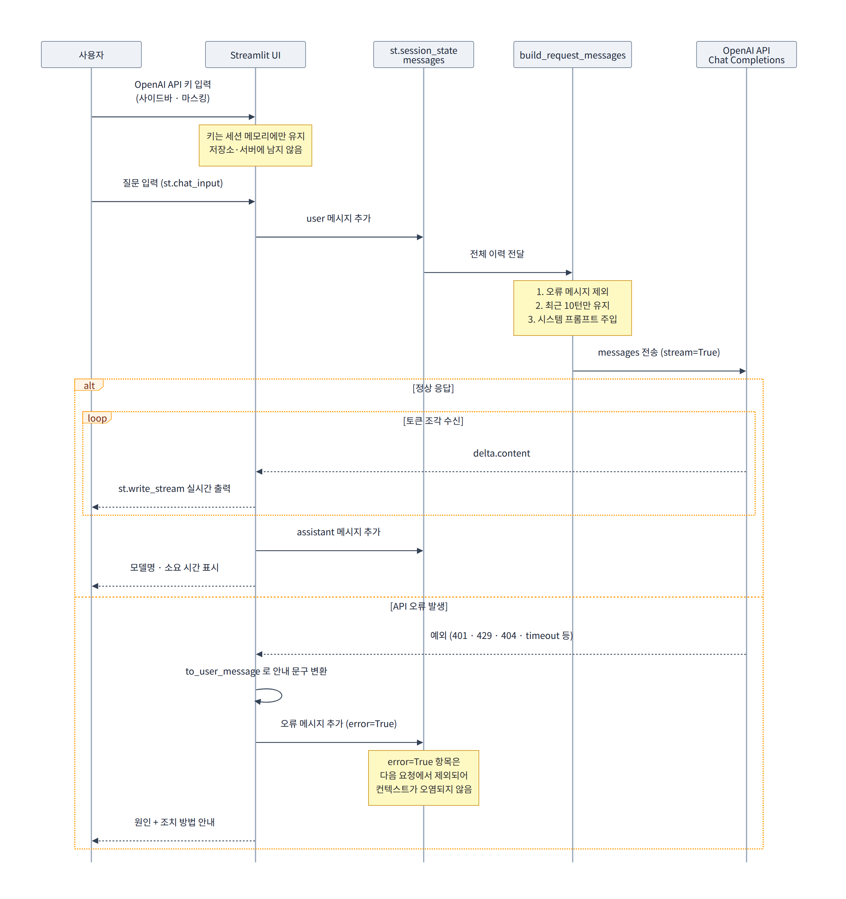

<div align="center">

# 테스트용 기술지원 AI Assistant

**Autodesk 제품 설치 기술지원 챗봇에 LLM 모델 기술 적용하여 고객 상담 기능 도입 가능 여부를<br/>검증하기 위해 만든 Streamlit 기반 프로토타입**

㈜상상진화 · Autodesk 공식 파트너 회사 기술지원 솔루션<br/>
2024.12 ~ 2025.12 · 기획/개발 1인 담당

<br/>


</div>

---

## 해당 저장소 위치

㈜상상진화 기술지원 솔루션 프로젝트는 **두 개의 저장소**로 구성되었다.

| 단계 | 저장소 | 역할 | 상태 |
|---|---|---|---|
| 1단계 | [KakaoChatbot](https://github.com/minjaejeon0827/KakaoChatbot) | 규칙 기반 카카오 챗봇 (AWS Lambda 서버리스) | 개발 완료 · 서비스 오픈 중단 |
| 2단계 | **test_AI_Assistant** *(현재 저장소)* | 자유 형식 질문 대응 LLM 모델 상담 프로토타입 | PoC 완료 · 개발 중단 |

1단계 챗봇은 **버튼으로 선택하는 정형 문의**를 자동화 처리한다. 다만 "설치 중 오류 발생!(코드 1603)" 같은 **비정형 질문은 구조상 처리할 수 없다.** 이 저장소는 그 공백을 LLM 모델 사용하여 대처할 수 있는지 확인하기 위한 최소 실험이다.

> **프로젝트 배경 · 아키텍처 · 트러블슈팅 전체 내용은 [1단계 저장소 README](https://github.com/minjaejeon0827/KakaoChatbot) 참고.**

---

## 검증 목표와 결과

| 검증 항목 | 결과 |
|---|---|
| 비개발자도 쓸 수 있는 대화형 UI를 빠르게 만들 수 있는가 | Streamlit으로 약 50줄 수준에서 구현 가능 확인 |
| API 키를 저장소에 남기지 않고 안전하게 다룰 수 있는가 | 사이드바 입력 + 세션 메모리 보관 방식으로 해결 |
| 멀티턴 대화 맥락을 유지할 수 있는가 | `st.session_state` 기반 이력 누적으로 유지 확인 |
| **Autodesk 파트너 회사 기술지원 지식을 반영한 답변이 가능한가** | **불가 — 범용 모델 그대로는 Autodesk 제품 설치 절차를 정확히 답변하지 못함** |

마지막 항목이 이 PoC의 결론이다. **검색 단계(RAG) 없이 LLM 모델만 붙이는 방식으로는 기술지원 업무에 투입할 수 없다**는 것을 확인했고,
이 판단이 1단계 저장소의 RAG 파이프라인 설계로 이어졌다.

---

## 시연

<!-- TODO: assets/screenshot.png 추가 후 아래 주석 해제 -->
<!--
<div align="center">
  
</div>
-->

---

## 동작 구조

<div align="center">
  <picture>
    <source media="(prefers-color-scheme: dark)" srcset="assets/assistant-flow-dark.png">
    <source media="(prefers-color-scheme: light)" srcset="assets/assistant-flow.png">
    
  </picture>
</div>


---

## 구현 상세

코드는 짧지만 아래처럼 다섯 가지 판단이 들어가 있다.

### 1. API 키를 코드나 환경 변수가 아닌 화면 입력으로 받은 이유

```python
api_key = st.text_input("OpenAI API Key", type="password", ...).strip()
```

공개 저장소이므로 키가 코드나 `.env`에 남으면 유출 위험이 있다. 사이드바 입력 방식은 **키가 세션 메모리에만 존재하고 저장소·서버 어디에도 기록되지 않는다.** `type="password"`로 화면 노출도 차단했다. 붙여넣기 시 섞여 들어오는 공백은 `.strip()`으로 제거한다. 인증 실패 원인 중 상당수가 앞뒤 공백이기 때문이다.

### 2. 클라이언트를 `st.cache_resource` 대신 세션 상태에 보관한 이유

```python
if st.session_state.get("_client_key") != api_key:
    st.session_state["_client"] = OpenAI(api_key=api_key, timeout=..., max_retries=...)
```

`st.cache_resource`는 **프로세스 전역 캐시**이다. 여러 사용자가 접속하는 배포 환경에서 A 사용자의 키로 만든 클라이언트가 B 사용자에게 재사용될 수 있다. `st.session_state`는 브라우저 세션 단위이므로 이 문제가 발생하지 않는다. 키가 바뀔 때만 새로 생성하므로 매 재실행마다 커넥션이 새로 열리지도 않는다.

### 3. 시스템 프롬프트로 역할과 한계를 고정한 이유

```python
SYSTEM_PROMPT = """당신은 Autodesk 제품 설치 기술지원 담당자입니다.
...
2. 확실하지 않은 정보는 추측하지 않고 모른다고 말합니다.
..."""
```

검색(RAG) 단계가 없는 현 구조에서 모델은 학습 데이터에만 의존한다. 설치 절차처럼 **오답 시 사용자에게 실질적 피해가 발생하는 영역**에서는 "모르면 모른다고 답하라"는 지침을 명시해 환각을 억제하는 것이 최소한의 안전장치이다. 다만 이것은 완화책일 뿐 해결책이 아니며, 근본 해결은 RAG 도입이다.

### 4. 전체 이력이 아닌 최근 N턴만 전송하는 이유

```python
usable  = [m for m in st.session_state["messages"] if not m.get("error")]
trimmed = usable[-(MAX_HISTORY_TURNS * 2):]
return [{"role": "system", "content": SYSTEM_PROMPT}] + trimmed
```

LLM API는 **무상태(stateless)** 이므로 맥락 유지를 위해 매 턴 이력을 다시 보내야 한다. 초기 구현은 전체 이력을 그대로 전송했고, 이 경우 **토큰 사용량이 대화 길이에 비례해 선형 증가**하다가 컨텍스트 한계에 도달한다.

최근 10턴만 유지하도록 윈도우를 적용해 요청 크기의 상한을 고정했다. 오래된 맥락이 필요한 대화에서는 정보가 잘리는 단점이 있으며, 이는 요약 기반 압축으로 보완할 수 있다.

### 5. 오류 메시지를 화면에는 남기되 요청에서는 제외한 이유

```python
st.session_state["messages"].append({"role": "assistant", "content": msg, "error": True})
```

API 오류가 발생했을 때 두 가지 요구가 충돌한다. 사용자는 **무슨 일이 있었는지 알아야 하고**, 모델은 **그 오류 문구를 대화 내용으로 오인하면 안 된다.**

메시지에 `error` 플래그를 두어 화면 렌더링에는 포함하고 `build_request_messages()`에서는 제외하는 방식으로 두 요구를 동시에 만족시켰다. 오류가 반복되어도 컨텍스트가 오염되지 않는다.

---

## 마이그레이션 기록

### 배경

초기 구현은 `openai` 0.28.1(2023.10 릴리스)을 사용했다. 이후 SDK가 1.0에서 **모듈 전역 함수 방식에서 클라이언트 객체 방식으로 전면 변경**되었고, 기본 모델로 쓰던 `gpt-3.5-turbo`도 공식 Deprecated 처리되었다. 구버전에 머무를 경우 최신 모델을 사용할 수 없고 보안 패치도 적용되지 않는다.

### 변경 내역

| 항목 | 변경 전 (`openai` 0.28.1) | 변경 후 (`openai` 3.x) |
|---|---|---|
| 인증 | `openai.api_key = key` (전역 상태) | `client = OpenAI(api_key=key)` (객체 주입) |
| 호출 | `openai.ChatCompletion.create(...)` | `client.chat.completions.create(...)` |
| 응답 접근 | `response["choices"][0]["message"]["content"]` | `chunk.choices[0].delta.content` |
| 예외 | 종류 구분 없음 | `AuthenticationError` 등 타입별 분기 |
| 타임아웃·재시도 | 미설정 | `timeout=30.0`, `max_retries=2` |
| 응답 방식 | 전체 생성 후 일괄 출력 | 스트리밍 실시간 출력 |
| 모델 | `gpt-3.5-turbo` (Deprecated) | `gpt-5.6-terra` (선택 가능) |

### 응답 방식 전환의 효과

전체 생성 방식은 모델이 답변을 끝까지 만들 때까지 화면이 멈춘다. 답변이 길수록 대기 시간이 길어지고, 사용자는 앱이 멈췄다고 인식한다.

스트리밍은 **첫 토큰이 도착하는 즉시 출력이 시작**되므로 전체 완료 시간은 같아도 체감 대기 시간이 크게 줄어든다. 이는 1단계 카카오 챗봇에서 겪었던 "5초 응답 제한" 문제와 같은 성격의 과제이며, 그때는 재요청 UX로, 여기서는 스트리밍으로 해결했다.

### Responses API 전환을 보류한 이유

OpenAI는 현재 Responses API를 표준 인터페이스로, Chat Completions를 레거시로 안내하고 있다. 그럼에도 이번 작업에서 Chat Completions를 유지한 이유는 다음과 같다.

1. 이번 작업의 목표는 **구버전 SDK 탈피**이며, 두 가지 변경을 한 번에 진행하면 문제 발생 시 원인 격리가 어렵다.
2. Chat Completions는 현재도 정상 지원되며 최신 모델을 사용할 수 있다.
3. API 호출부를 `stream_answer()` 함수 하나로 격리해 두었으므로, 전환 시 수정 범위는 해당 함수로 한정된다.

전환 시 변경되는 부분은 다음과 같다.

```python
# Chat Completions (현재)
stream = client.chat.completions.create(model=model, messages=messages, stream=True)
for chunk in stream:
    if chunk.choices and chunk.choices[0].delta.content:
        yield chunk.choices[0].delta.content

# Responses API (전환 시)
stream = client.responses.create(model=model, input=messages, stream=True)
for event in stream:
    if event.type == "response.output_text.delta":
        yield event.delta
```

---

## 기술 스택

| 구분 | 사용 기술 |
|---|---|
| 언어 | Python 3.12 |
| UI | Streamlit 1.40+ |
| LLM | OpenAI Chat Completions (`openai` SDK 3.x) |
| 모델 | `gpt-5.6-terra` 기본 · 사이드바에서 변경 가능 |

> 모델명은 수시로 추가·폐기되므로 `app.py`의 `MODEL_OPTIONS` 한 곳에서만 관리한다.
> 폐기된 모델 호출 시 `NotFoundError`가 발생하며 사용자에게 다른 모델 선택을 안내한다.
> 최신 목록은 [OpenAI 모델 카탈로그](https://developers.openai.com/api/docs/models)에서 확인한다.

---

## 실행 방법

### 1. 저장소 복제 및 가상환경 생성

```bash
git clone https://github.com/minjaejeon0827/test_AI_Assistant.git
cd test_AI_Assistant

python -m venv .venv
source .venv/bin/activate      # Windows: .venv\Scripts\activate
```

### 2. 패키지 설치

```bash
pip install -r requirements.txt
```

> 이전 버전(`openai` 0.28.x)이 설치되어 있다면 먼저 제거한다.
> ```bash
> pip uninstall openai -y && pip install -r requirements.txt
> ```

### 3. 실행

```bash
streamlit run app.py
```

브라우저가 열리면 좌측 사이드바에 [OpenAI API 키](https://platform.openai.com/api-keys)를 입력한 뒤 질문을 입력한다.

---

## 확인된 한계

PoC 과정에서 드러난 문제들이다. **이 목록이 곧 1단계 저장소의 RAG 설계 근거가 되었다.**

### 해결 완료 (2026.09)

| 한계 | 조치 |
|---|---|
| 구버전 SDK 사용 (`openai` 0.28.1) | 현행 SDK 3.x 마이그레이션. 클라이언트 객체 방식으로 전환 |
| 폐기 모델 사용 (`gpt-3.5-turbo`) | 현행 모델로 교체 및 사이드바 선택 기능 추가 |
| 오류 처리 부재 | 예외 8종을 원인·조치 문구로 변환. 어떤 예외에도 화면이 깨지지 않음 |
| 응답 대기 중 피드백 없음 | `stream=True` + `st.write_stream` 으로 실시간 출력 |
| 토큰 비용 선형 증가 | 최근 10턴 윈도우 적용으로 요청 크기 상한 고정 |
| 역할 고정 장치 없음 | 시스템 프롬프트로 기술지원 담당자 역할 및 응답 규칙 고정 |

### 미해결

| 한계 | 원인 | 실제 영향 | 개선 방향 |
|---|---|---|---|
| **Autodesk 파트너 회사 기술지원 지식 미반영** | 범용 LLM 모델을 그대로 호출, 검색 단계 없음 | AutoCAD 제품 설치 절차 질문 시 일반적인 내용으로만 답변. 실무 투입 불가 | 제품 설치 가이드 문서를 벡터화해 검색 후 근거와 함께 답변 (RAG) |
| 답변 신뢰성 보장 장치 부족 | 근거 문서 없이 생성. 시스템 프롬프트는 완화책일 뿐 | 제품 설치 안내의 경우 오답 안내 시 사용자에게 실질적 피해 발생 | 근거 미검색 시 상담원 연결 전환 |
| 오래된 맥락 손실 | 최근 10턴 윈도우 적용의 반대급부 | 긴 대화에서 앞부분 내용을 참조하지 못함 | 이력 요약 압축 방식 병행 |
| 대화 기록 휘발 | `st.session_state`는 브라우저 세션 한정 | 새로고침 시 대화 소실 | 외부 저장소 연동 |
| 사용량 상한 없음 | 호출량 제어 로직 미구현 | 다수 사용 시 비용 예측 불가 | 세션별 호출 횟수 제한 및 사용량 로깅 |

---

## 개선 계획

해당 프로젝트는 회사 사정으로 인하여 중단되었으나, 이후 진행할 프로젝트에 적용할 순서를 다음과 같이 정리해 두었다.

- [x] `openai` SDK 마이그레이션 (0.28.1 → 3.x) 및 응답 스트리밍 적용
- [x] 시스템 프롬프트로 기술지원 담당자 역할 고정
- [x] 예외 처리 및 대화 이력 윈도우 적용
- [ ] 사용량 상한 설정 및 호출 로깅
- [ ] **제품 설치 가이드 문서 기반 RAG 파이프라인 연결** — 1단계 저장소 `utils/openAI.py` 소스파일의 PoC 코드 활용
- [ ] 근거 문서 미검색 시 상담원 연결 전환 로직
- [ ] 응답 정확도 평가셋 구성 및 측정
- [ ] Responses API 전환 검토 (아래 참고)

---

## 관련 저장소

| 저장소 | 내용 |
|---|---|
| [KakaoChatbot](https://github.com/minjaejeon0827/KakaoChatbot) | 1단계 — 규칙 기반 카카오 챗봇, 서버리스(AWS Lambda) 아키텍처, 트러블슈팅 전체 기록 |
| **test_AI_Assistant** | *(현재 저장소)* 2단계 — LLM 모델 상담 프로토타입 |

---

<div align="center">

**전민재** (Minjae Jeon)

[](https://github.com/minjaejeon0827)
<!-- TODO: 이메일 주소 확인 후 수정 -->
[](mailto:minjaejeon0827@gmail.com)

본 저장소는 ㈜상상진화 재직 중 수행한 기술 검증(PoC) 결과물이며,<br/>
공개한 소스코드는 프로토타입 모델입니다.

</div>
